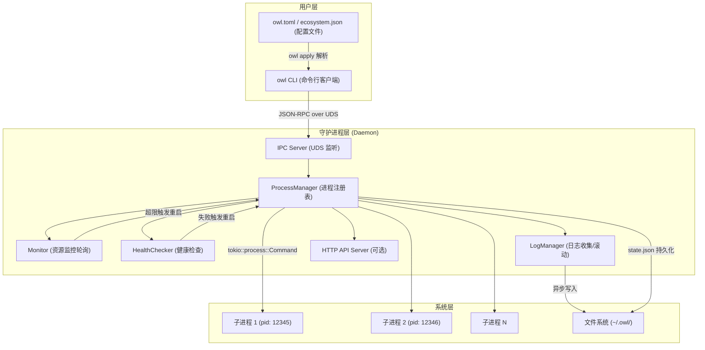
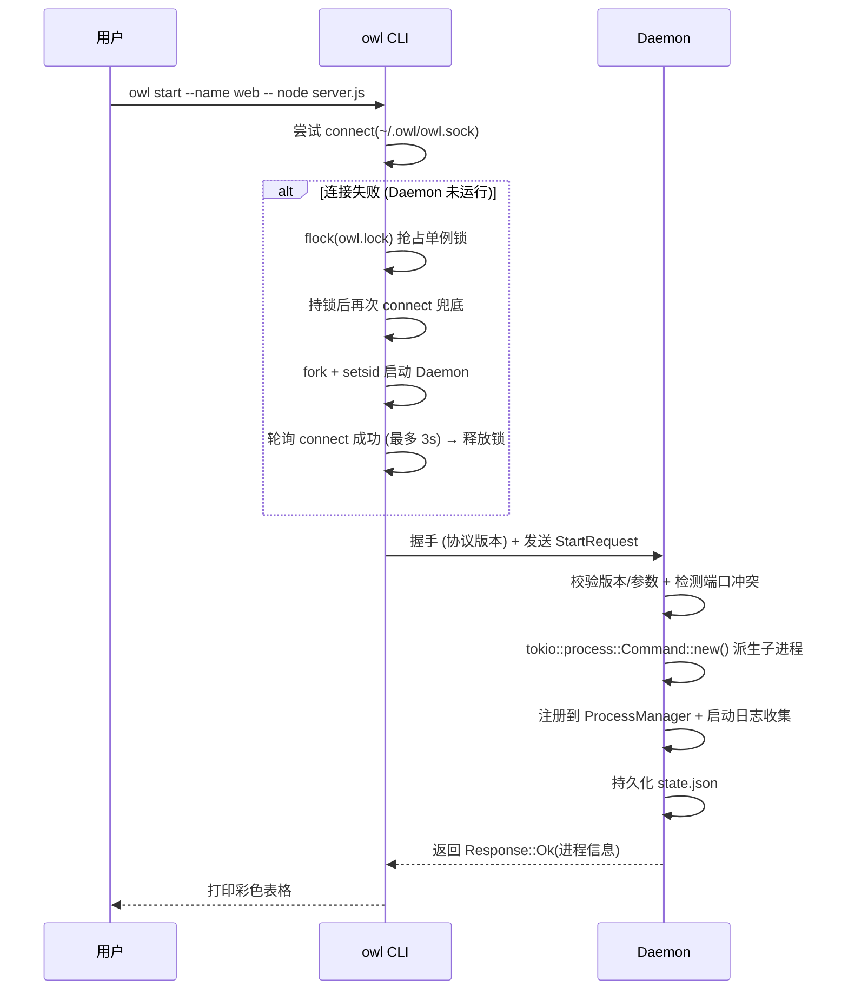
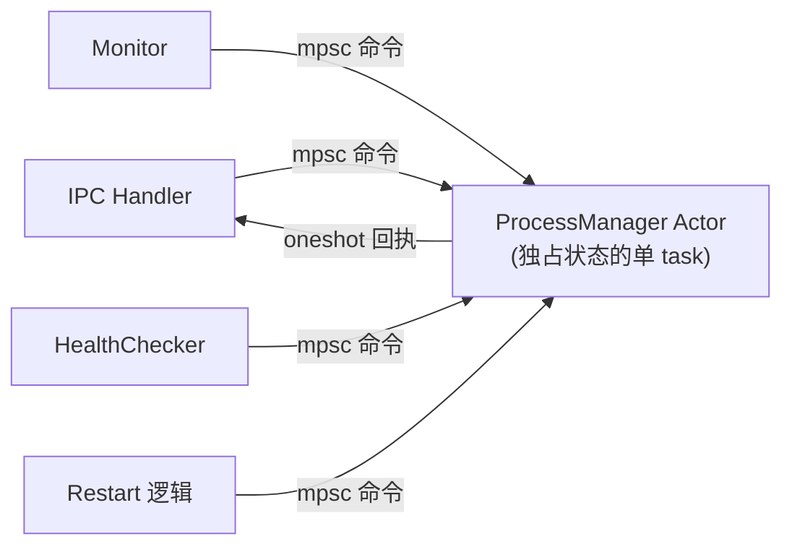
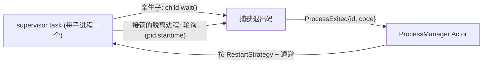

# 实施方案 — Owl 进程管理器 (Rust 版 PM2)

## 实施收口状态（2026-06-02）

> 本节用于把方案与当前代码状态对齐，避免“文档计划”和“实现现状”漂移。

### 总体结论

- Phase 1：✅ 已完成
- Phase 2：✅ 已完成（`reload` 保持可用实现；固定端口场景不强推“先起新后停旧”）
- Phase 3：
  - #1 HTTP API + WebSocket：✅ 已完成
  - #2 systemd / launchd 生成：✅ 已完成
  - #3 `save` / `resurrect`：✅ 已完成
  - #4 Windows 命名管道支持：⏸️ 本轮明确不做
  - #5 `owl monit` TUI：✅ 已完成（交互式面板）

### 关键偏差说明（相对原始计划）

- `reload` 的“真无停机”在固定端口应用上存在天然端口冲突风险（同端口 bind）；当前策略以稳定可用为先，未强行在固定端口场景推进“先起新后停旧”。
- 日志能力已扩展到：按大小轮转 + 按日期切分 + gzip 归档，且 `owl logs -n` 可跨当前文件/轮转文件/`.gz` 归档聚合读取尾部。
- `ecosystem.config.json` 兼容解析已接入 `owl apply` 自动识别（`.json` 走 ecosystem，其他走 `owl.toml`）。

## 项目定位

Owl 是一个使用 **Rust** 编写的高性能、语言无关的进程管理器，定位为 PM2 的生产级替代方案。

> [!TIP]
> 项目名称 **Owl（猫头鹰）** 寓意 "永远醒着、日夜守护你的进程"。

> [!IMPORTANT]
> **平台定位:Unix-first**。Phase 1/2 聚焦 Linux 与 macOS（依赖 `setsid`、UDS、POSIX 信号）。Windows 支持（命名管道 + Job Object）作为 Phase 3 适配项,届时信号语义、后台化策略会有专门分支实现。

---

## 一、借鉴项目深度分析

### 1.1 PM2 — 经典架构参考

| 特性 | PM2 实现 | Owl 借鉴要点 |
|:---|:---|:---|
| 架构 | Client ↔ Daemon (God.js) 通过 `rpc.sock` 通信 | ✅ 采用相同的 Client-Daemon 分离架构 |
| 进程模型 | `child_process.fork()` + `cluster.fork()` | ✅ 使用 Tokio `Command` 异步派生子进程 |
| 状态持久化 | `dump.pm2` JSON 文件 | ✅ 使用 JSON 持久化到 `~/.owl/state.json` |
| 日志管理 | 重定向 stdout/stderr 到文件 | ✅ 异步管道 + 日志滚动切分 |
| 集群模式 | Node.js `cluster` 模块共享端口 | ⚠️ 不依赖语言特性，改用多实例 + 端口分配 |

### 1.2 OxMgr — 声明式配置思想

| 特性 | OxMgr 实现 | Owl 借鉴要点 |
|:---|:---|:---|
| 配置方式 | `oxfile.toml` 声明式定义 | ✅ 支持 `owl.toml` 声明式批量管理 |
| 幂等操作 | `oxmgr apply` 收敛到期望状态 | ✅ `owl apply` 一键收敛 |
| 重启策略 | `always` / `on-failure` / `never` | ✅ 可配置的重启策略枚举 |
| 系统集成 | 生成 systemd / launchd 配置 | 🔮 Phase 3 考虑 |

### 1.3 PMDaemon — 高级运维特性

| 特性 | PMDaemon 实现 | Owl 借鉴要点 |
|:---|:---|:---|
| 端口管理 | 端口范围分配、冲突检测、运行时覆盖 | ✅ `--port 3000-3003` 或 `auto:5000-5100` |
| 健康检查 | HTTP 探针 + 脚本探针 | ✅ 支持 HTTP/脚本健康检查 |
| 内存限制 | `--max-memory 500M` 超限自动重启 | ✅ 周期性采样 + 阈值触发重启 |
| Web API | Axum REST + WebSocket 实时推送 | ✅ 内置轻量 HTTP API (Phase 2) |
| 阻塞启动 | `--wait-ready` 等健康后才返回 | ✅ CLI 阻塞等待进程就绪 |
| 生态配置 | `ecosystem.json` / YAML / TOML | ✅ 多格式配置文件支持 |

---

## 二、架构设计

### 2.1 三层架构



### 2.2 启动流程



---

## 三、项目源码结构

```
owl/
├── Cargo.toml
├── README.md
├── owl.toml.example          # 声明式配置示例文件
└── src/
    ├── main.rs               # 入口：根据 subcommand 分发到 CLI 或 Daemon
    ├── cli/
    │   ├── mod.rs             # CLI 模块入口
    │   ├── commands.rs        # clap 子命令定义
    │   ├── client.rs          # UDS 客户端：连接 Daemon、发送请求、接收响应
    │   ├── output.rs          # 终端输出格式化（彩色表格、JSON）
    │   └── daemon_launcher.rs # 负责检测并拉起后台 Daemon 进程
    ├── daemon/
    │   ├── mod.rs             # Daemon 模块入口
    │   ├── server.rs          # UDS Server 事件循环（accept + dispatch）
    │   ├── handler.rs         # RPC 请求分发与处理逻辑
    │   └── api.rs             # 可选的 HTTP REST API 服务 (Phase 2)
    ├── process/
    │   ├── mod.rs             # 进程管理模块入口
    │   ├── manager.rs         # ProcessManager：进程注册表、CRUD 操作
    │   ├── entry.rs           # ProcessEntry：单个进程的完整状态与生命周期
    │   ├── monitor.rs         # 资源监控：定期采集 CPU/Memory，触发超限重启
    │   └── health.rs          # 健康检查：HTTP 探针 / 脚本探针
    ├── config/
    │   ├── mod.rs             # 配置解析模块入口
    │   ├── owl_config.rs      # owl.toml 声明式配置解析
    │   └── ecosystem.rs       # PM2 ecosystem.config.json 兼容解析
    ├── log/
    │   ├── mod.rs             # 日志管理模块入口
    │   ├── daemon_log.rs      # Daemon 自身日志 (基于 owl-logger：轮转/压缩/清理)
    │   └── process_log.rs     # 子进程 stdout/stderr 异步管道收集与文件写入
    ├── ipc/
    │   ├── mod.rs             # IPC 协议模块入口
    │   ├── protocol.rs        # 长度前缀帧编解码器 (Length-Delimited Framing)
    │   └── message.rs         # Request / Response 枚举定义
    └── common/
        ├── mod.rs             # 公共模块
        ├── paths.rs           # ~/.owl/ 路径管理（支持 OWL_HOME 环境变量覆盖，便于测试隔离）
        ├── state.rs           # state.json 持久化读写（带 schema_version，原子写入 temp+rename）
        └── errors.rs          # 统一错误类型定义
```

---

## 四、核心数据结构

### 4.1 IPC 消息协议 (`src/ipc/message.rs`)

```rust
use serde::{Deserialize, Serialize};

/// 协议版本：CLI 与 Daemon 必须一致，否则提示用户 `owl kill` 重启 Daemon。
/// 每次破坏性修改 Request/Response 枚举时递增。
pub const PROTOCOL_VERSION: u32 = 1;

/// 每个连接的第一帧：握手，校验 CLI/Daemon 版本是否兼容。
#[derive(Serialize, Deserialize, Debug, Clone)]
pub struct Handshake {
    pub protocol_version: u32,
    pub client_version: String, // env!("CARGO_PKG_VERSION")
}

/// CLI → Daemon 请求
///
/// `target` 统一接受三种形式：精确 id（数字）、name、或字面量 `"all"`（批量）。
/// 解析优先级：先按数字 id → 再按 name 精确匹配；`"all"` 为保留字。
#[derive(Serialize, Deserialize, Debug, Clone)]
pub enum Request {
    Start(StartOptions),
    Stop { target: String },              // 支持 "all"
    Restart { target: String },           // 支持 "all"
    Reload { target: String },            // 无停机滚动重启（Phase 2，见 7.14/9）
    Delete { target: String },            // 支持 "all"
    Scale { name: String, instances: u32 }, // 运行时增减实例数
    List,
    Info { target: String },
    Logs { target: String, lines: usize, follow: bool },
    Flush { target: String },             // 清空日志
    Reset { target: String },             // 清零重启计数
    SetLogLevel { level: String },        // 运行时调 Daemon 自身日志级别（owl-logger set_level/set_filter）
    Apply { config_path: String, prune: bool, dry_run: bool }, // prune 删除已移除项；dry_run 仅预览 diff
    Kill, // 终止 Daemon（按方案 B，不杀在线子进程，仅退出 Daemon）
}

#[derive(Serialize, Deserialize, Debug, Clone)]
pub struct StartOptions {
    pub name: Option<String>,
    pub command: String,                      // 可执行文件名/路径，**直接 exec，不经 shell**（见 7.11）
    pub args: Vec<String>,                    // 显式参数；需 shell 特性时用户显式 `sh -c "..."`
    pub cwd: Option<String>,
    pub env: HashMap<String, String>,
    pub instances: u32,                       // 默认 1；每实例注入 PORT / OWL_INSTANCE_ID / NODE_APP_INSTANCE
    pub port: Option<String>,                 // "3000" 或 "3000-3003" 或 "auto:5000-5100"
    pub max_memory: Option<u64>,              // 字节（CLI/配置层用 parse_size 将 "512M"/"1G" 解析为字节）
    pub max_restarts: Option<u32>,            // 最大自动重启次数
    pub restart_delay: Option<u64>,           // 设值=固定重启间隔(ms,禁用退避)；None=用 7.4 指数退避
    pub restart_strategy: RestartStrategy,
    pub kill_signal: Option<String>,          // 停止信号，默认 SIGTERM（如 nginx 用 "SIGQUIT"）
    pub health_check: Option<HealthCheckConfig>,
    pub wait_ready: bool,
    pub ready_timeout_secs: Option<u64>,      // wait_ready 超时（见 7.14）
}

#[derive(Serialize, Deserialize, Debug, Clone)]
pub enum RestartStrategy {
    Always,     // 任何退出都重启
    OnFailure,  // 仅非零退出码重启
    Never,      // 不自动重启
}

#[derive(Serialize, Deserialize, Debug, Clone)]
pub struct HealthCheckConfig {
    pub url: Option<String>,          // HTTP 探针 URL，支持 {port} 占位符（auto 端口动态替换为实际分配端口）
    pub script: Option<String>,       // 脚本路径
    pub interval_secs: u64,           // 检查间隔
    pub timeout_secs: u64,            // 超时时间
    pub max_failures: u32,            // 连续失败次数后标记不健康
}

/// Daemon → CLI 响应
///
/// 注意:一条连接上可发送 **多帧** 响应（长度前缀帧流），用于支持
/// `logs --follow`（持续 LogChunk）与 `--wait-ready`（多次 Progress 直到 Ready）。
/// 普通命令则只发送单帧后由 Daemon/CLI 关闭连接。
#[derive(Serialize, Deserialize, Debug, Clone)]
pub enum Response {
    Ok(String),
    ProcessList(Vec<ProcessInfo>),
    ProcessDetail(ProcessInfo),
    LogLines(Vec<String>),     // 一次性返回（logs 非 follow 模式）
    LogChunk(Vec<String>),     // 流式追加（logs --follow），可重复出现
    Progress(String),          // wait-ready 等待期间的中间进度
    Ready(ProcessInfo),        // wait-ready 完成：进程已就绪
    StreamEnd,                 // 流式响应结束标记
    VersionMismatch { daemon_version: u32 },
    Error(String),
}
```

### 4.2 进程状态 (`src/process/entry.rs`)

> [!IMPORTANT]
> **持久化配置与运行时状态分离**。`PersistedApp`（写入 `state.json`，仅含用户意图/配置）与 `RuntimeStatus`（内存态，含 pid/cpu/内存/uptime 等易变指标，**不持久化**）解耦。好处:① 避免每次采样都写盘抖动;② Daemon 重启后只恢复配置,运行时指标重新采集。`ProcessInfo` 仅作为 IPC/展示用的「配置 + 运行时」合并视图。

```rust
/// 持久化到 state.json：用户意图与配置，重启 Daemon 后据此恢复。
#[derive(Serialize, Deserialize, Debug, Clone)]
pub struct PersistedApp {
    pub id: u32,
    pub name: String,
    pub command: String,
    pub args: Vec<String>,
    pub cwd: Option<String>,
    pub env: HashMap<String, String>,
    pub port: Option<u16>,
    pub max_memory: Option<u64>,
    pub max_restarts: Option<u32>,
    pub restart_strategy: RestartStrategy,
    pub health_check: Option<HealthCheckConfig>,
    pub created_at: i64,        // Unix epoch 秒，显示时再格式化（避免反复解析字符串）
    /// 重接管校验：(pid, 进程启动时刻)，防止 PID 复用误认。
    pub last_pid: Option<u32>,
    pub last_pid_start_time: Option<u64>,
}

/// 内存态运行指标，不持久化。
#[derive(Debug, Clone)]
pub struct RuntimeStatus {
    pub pid: Option<u32>,
    pub status: ProcessStatus,
    pub health: HealthState,
    pub restarts: u32,
    pub uptime_secs: u64,
    pub cpu_percent: f32,
    pub memory_bytes: u64,
}

/// IPC / 展示用的合并视图（由 PersistedApp + RuntimeStatus 组装）。
#[derive(Serialize, Deserialize, Debug, Clone)]
pub struct ProcessInfo {
    pub id: u32,
    pub name: String,
    pub command: String,
    pub args: Vec<String>,
    pub pid: Option<u32>,
    pub status: ProcessStatus,
    pub health: HealthState,
    pub port: Option<u16>,
    pub restarts: u32,
    pub max_restarts: Option<u32>,
    pub uptime_secs: u64,
    pub cpu_percent: f32,
    pub memory_bytes: u64,
    pub max_memory: Option<u64>,
    pub created_at: i64,
    pub restart_strategy: RestartStrategy,
}

#[derive(Serialize, Deserialize, Debug, Clone, PartialEq)]
pub enum ProcessStatus {
    Launching,
    Online,
    Stopping,
    Stopped,
    Errored,    // 超过 max_restarts，放弃重启
}

/// 健康检查结果，与运行状态正交（一个 Online 进程也可能 Unhealthy）。
#[derive(Serialize, Deserialize, Debug, Clone, PartialEq)]
pub enum HealthState {
    Unknown,    // 未配置健康检查或尚未首检
    Healthy,
    Unhealthy,
}
```

`state.json` 顶层用带版本号的包装结构，便于后续 schema 迁移（见 7.8）：

```rust
/// state.json 顶层结构。读到旧版本时按 schema_version 迁移或安全降级。
#[derive(Serialize, Deserialize, Debug, Clone)]
pub struct StateFile {
    pub schema_version: u32,        // 当前为 1
    pub next_id: u32,               // 单调递增的 id 分配游标
    pub apps: Vec<PersistedApp>,
}
```

### 4.3 声明式配置 (`owl.toml`)

```toml
# owl.toml 示例
[[apps]]
name = "web-api"
command = "node"
args = ["server.js"]
cwd = "/opt/apps/web"
instances = 4
port = "3000-3003"
max_memory = "512M"
restart_strategy = "on-failure"
max_restarts = 10

[apps.env]
NODE_ENV = "production"
LOG_LEVEL = "info"

[apps.health_check]
url = "http://localhost:3000/health"
interval_secs = 30
timeout_secs = 5

[[apps]]
name = "worker"
command = "./target/release/worker"
instances = 2
restart_strategy = "always"
restart_delay = 2000
```

---

## 五、Cargo 依赖选型

| 依赖 | 用途 | 版本说明 |
|:---|:---|:---|
| `tokio` | 异步运行时 + UDS + 子进程管理 | **精简 features**：`["rt","net","process","io-util","time","signal","sync","macros","fs"]`（不用 `full`）；daemon 用 `current_thread` 单线程运行时（见 9.1） |
| `clap` | CLI 参数解析 | `features = ["derive"]` |
| `serde` + `serde_json` | IPC 消息序列化 / state.json 持久化 | — |
| `toml` | `owl.toml` 配置解析 | — |
| `colored` | 终端彩色输出 | — |
| `tabled` | 终端表格渲染 (`owl list`) | — |
| `chrono` | 时间戳格式化（存储用 epoch i64，显示时格式化） | — |
| `dirs` | 获取 `$HOME` 路径（`~/.owl/`，支持 `OWL_HOME` 覆盖） | — |
| `nix` 或 `rustix` | Unix 信号 (`SIGTERM`/`SIGKILL`) + `setsid` | 仅 Unix；优先考虑更轻量现代的 `rustix` |
| `sysinfo` | 采集进程 CPU / 内存指标（**仅** targeted refresh，禁全量；后续按需替换为 `/proc` 原生解析，见 9.2） | 跨平台兜底 |
| `thiserror` | 库内统一错误类型定义 (`common/errors.rs`) | — |
| `anyhow` | 应用边界（main/handler）错误聚合与上下文 | — |
| **`owl-logger`** | **Daemon 自身日志：彩色输出、按大小/日期轮转 + gz 压缩、保留期清理、panic+Backtrace 捕获、结构化 JSON、运行时动态调级、PII 脱敏、按级别分文件(error.log)** | **`0.2.0` (自家生态)**；`otlp` feature **默认关闭**(会拉入 reqwest，与 9.1 精简 footprint 冲突) |
| `axum` + `tokio-tungstenite` | HTTP API + WebSocket (Phase 2/3) | 可选 feature，默认关闭以保持核心二进制精简 |
| ~~`reqwest`~~ | HTTP 健康检查 | **不引入**：探针只需 `GET /health → 2xx`，用裸 `TcpStream` 手写最小请求（省 1–2MB 依赖树，见 9.1） |
| `ratatui` + `crossterm` | `owl monit` 终端实时监控面板 (Phase 3) | 可选 feature |

> [!TIP]
> `owl-logger` 是 Owl 生态的姊妹项目 ([xmi-one/owl-logger](https://github.com/xmi-one/owl-logger))，基于 `tracing` 构建，**当前 `0.2.0`**。用它替代手动配置 `tracing-subscriber`，Daemon 可直接获得生产级日志能力，并与 Owl 品牌统一。Owl 重点借用以下 0.2.0 能力：
> - **一行初始化 + 环境变量配置**：`owl_logger::try_init_from_env()` 读取 `OWL_LOG_LEVEL`/`OWL_LOG_FORMAT`/`OWL_LOG_DIR`/`OWL_LOG_FILE`（与 Owl 自己的 `OWL_HOME` 不冲突）。
> - **运行时动态调级**：`set_level`/`set_filter` 无需重启 Daemon 即可调日志详细度 → 暴露为 `owl log-level <level>` 命令（见 7.16/9.7）。
> - **按级别分文件**：`error_file(LogLevel::Error)` 额外落 `owl-daemon.error.log`，便于运维快速排障。
> - **panic + Backtrace 捕获**：与 9.5 的 per-task panic 隔离协同，崩溃栈直接进日志。
> - **结构化 JSON + PII 脱敏**：`Json` 格式接 ELK/Datadog；自动脱敏 `password`/`token` 等字段，符合合规。
> - **`Drop` 自动 flush + 有界异步队列(`lossy`/`buffered_lines_limit`)**：Daemon 自身日志非阻塞。
>
> ⚠️ **注意**：`owl-logger` 的 `otlp` feature 采用阻塞式 `reqwest` 上报 → 会把 reqwest 整棵依赖树拉回来，与 9.1「不引入 reqwest、精简 footprint」的目标冲突。因此 **OTLP 默认关闭**，仅在确需分布式追踪时按需开启（可归入 Phase 3）。
>
> 此外：`owl-logger` 仅负责 **Daemon 自身**日志；**子进程 stdout/stderr** 的采集/轮转是 Owl 自实现（`log/process_log.rs`，见 7.15/9.4），二者互不混淆。

---

## 六、分阶段实施计划

### Phase 1 — 核心骨架 🏗️ (MVP)

**目标**: 实现最小可用的 Client-Daemon 进程管理器。

| 序号 | 任务 | 涉及模块 |
|:---:|:---|:---|
| 1 | `cargo init` + Cargo.toml 依赖配置 | 根目录 |
| 2 | 实现 `~/.owl/` 目录管理、路径常量 | `common/paths.rs` |
| 3 | 定义 IPC 消息枚举 + 长度前缀编解码器 | `ipc/` |
| 4 | 实现 Daemon UDS Server 事件循环 | `daemon/server.rs` |
| 5 | 实现 CLI 客户端连接 + Daemon 自动拉起 | `cli/client.rs`, `cli/daemon_launcher.rs` |
| 6 | 实现 `ProcessManager`：start/stop/restart/delete/list | `process/manager.rs`, `process/entry.rs` |
| 7 | Daemon 自身日志初始化 (owl-logger) + 子进程 stdout/stderr 管道收集 | `log/daemon_log.rs`, `log/process_log.rs` |
| 8 | 实现 `state.json` 持久化与恢复 | `common/state.rs` |
| 9 | 实现 CLI 彩色表格输出 | `cli/output.rs` |
| 10 | 实现 `owl kill` 终止守护进程 | `daemon/handler.rs` |
| 11 | 自动重启 + 指数退避 + 最大重启次数限制 | `process/entry.rs` |
| 12 | 子进程后台化（`setsid` + 进程组，脱离存活）+ Daemon 启动重接管（`(pid,starttime)` 校验，方案 B，见 7.6） | `process/manager.rs` |
| 13 | per-child supervisor task：await 退出 / 存活探测 → 触发重启（见 7.12） | `process/entry.rs` |

**Phase 1 交付物**: 可以执行 `owl start`, `owl list`, `owl stop`, `owl restart`, `owl delete`, `owl logs`, `owl kill` 基本命令。

> [!WARNING]
> **子进程归属已定稿为方案 B(脱离存活 + 重接管),Phase 1 即需实现接管逻辑**。子进程不随 Daemon 退出而被杀;Daemon 启动时依据 `(pid, starttime)` 重接管在线进程(详见 7.6)。`owl save`/`resurrect`(Phase 3)是其开机自启的封装。

---

### Phase 2 — 高级特性 🔧

**目标**: 补齐生产环境所需的监控、配置、健康检查能力。

| 序号 | 任务 | 涉及模块 |
|:---:|:---|:---|
| 1 | 端口范围分配与冲突检测 | `process/manager.rs` |
| 2 | 资源监控 (CPU/Memory 采集) + 内存超限自动重启 | `process/monitor.rs` |
| 3 | `owl.toml` 声明式配置解析 + `owl apply` 命令 | `config/owl_config.rs` |
| 4 | PM2 `ecosystem.config.json` 兼容解析 | `config/ecosystem.rs` |
| 5 | HTTP 健康检查探针 + 脚本健康检查 | `process/health.rs` |
| 6 | `--wait-ready` 阻塞启动等待就绪 | `cli/commands.rs` |
| 7 | `owl info <name>` 详细信息展示 | `cli/output.rs` |
| 8 | 子进程日志滚动切分（按大小/日期，独立于 owl-logger） | `log/process_log.rs` |
| 9 | 可配置的重启策略 (`always`/`on-failure`/`never`) | `process/entry.rs` |
| 10 | `owl reload`：多实例**无停机滚动重启**（逐实例 起新→就绪→停旧，复用 7.14 就绪判定） | `process/manager.rs` |

---

### Phase 3 — 生态扩展 🌐

**目标**: 面向高级运维场景的扩展特性。

| 序号 | 任务 |
|:---:|:---|
| 1 | 内置 HTTP REST API + WebSocket 实时推送 |
| 2 | 生成 `systemd` / `launchd` 服务单元文件 |
| 3 | `owl save` + `owl resurrect` 开机恢复 |
| 4 | Windows 命名管道支持 |
| 5 | `owl monit` 终端实时监控面板 (TUI) |

---

## 七、关键设计决策

### 7.1 IPC 帧协议

采用 **4 字节大端序长度前缀 + JSON 负载** 的简单可靠方案：

```
┌──────────────┬──────────────────────────┐
│ 4 bytes len  │  JSON payload (UTF-8)    │
│ (big-endian) │  len bytes               │
└──────────────┴──────────────────────────┘
```

### 7.2 Daemon 后台化策略

CLI 通过 `std::process::Command` 启动自身的 `daemon` 子命令：
- Unix: 使用 `setsid()` 创建新会话，重定向 stdin/stdout/stderr 到 `/dev/null`
- 写入 `~/.owl/daemon.pid` 并创建 `~/.owl/owl.sock`

> [!NOTE]
> 拉起的**单例保证、陈旧 socket 处理、连接探测**统一以 7.7 为准（基于 `connect` 探测 + `flock`），本节不再单独描述「轮询 sock 文件」的旧方案。`daemon.pid` 同样需做陈旧检测：读取 pid 后校验进程存活且 `comm`/cmdline 确实是 owl daemon，避免 PID 复用误判。

### 7.3 平滑重启 (Graceful Shutdown)

子进程停止（`owl stop`/`restart`）：

```
1. 发送 kill_signal（默认 SIGTERM，可配置如 SIGQUIT）到进程组 → 等待 kill_timeout (默认 5s)
2. 如果超时 → 发送 SIGKILL 强制终止
3. 清理子进程资源 → 根据策略决定是否重启
```

**Daemon 自身的信号处理**（不止 `owl kill`）：Daemon 需捕获 `SIGTERM`/`SIGINT`（来自 `systemd stop` / `Ctrl-C`），走优雅退出流程：持久化 `state.json` → 删除 `owl.sock` 与 `daemon.pid` → 退出。**按方案 B,Daemon 退出不杀在线子进程**(它们脱离存活,下次启动重接管)。

### 7.4 崩溃退避算法

```
restart_delay = min(base_delay * 2^(consecutive_crashes - 1), max_delay)
base_delay  = 1s
max_delay   = 16s

示例: 1s → 2s → 4s → 8s → 16s → 16s → ...
如果进程持续运行超过 min_uptime（默认 30s，可配置），则重置 consecutive_crashes = 0
超过 max_restarts 后停止重试，标记为 Errored。
```

- **与 `restart_delay` 的关系**:`restart_delay` 设值时作为**固定重启间隔并禁用指数退避**;未设时才走上面的退避算法。二者不叠加。
- **uptime 用单调时钟**:`uptime` 基于 `tokio::time::Instant`/`std::time::Instant` 计算,避免墙钟被 NTP 校时跳变影响;`created_at` 才用墙钟 epoch(仅用于展示)。
- **`max_restarts` 是"窗口内连续崩溃"而非终身累计**:它约束的是 `consecutive_crashes` 计数器;进程健康运行超过 `min_uptime` 即清零。否则一个跑了半年、偶发重启的进程会无辜触顶进 Errored。

### 7.5 并发与状态所有权模型（Actor 模式）

> [!IMPORTANT]
> 这是 Tokio 项目最易踩坑、且会渗透到所有模块的决策,**必须先定稿**。

`ProcessManager` 会被多方并发访问:IPC handler、资源监控、健康检查、自动重启逻辑。采用 **单所有者 Actor 模式** 而非 `Arc<Mutex<ProcessManager>>`(配合 9.1 的 `current_thread` 单线程运行时,Actor 独占状态更自然):



- 单个 task 独占 `ProcessManager` 状态,所有变更通过 `mpsc::channel` 发命令、`oneshot` 回结果。
- **规避「持锁跨 `.await`」**:在持有 `Mutex` 时执行 `tokio::process` 派生或文件写入会导致死锁/卡顿,Actor 模式天然避免。
- 实现简单、无锁竞争、状态变更串行化易于推理。

### 7.6 子进程归属与重接管

明确「Daemon 崩溃/重启后,被管理子进程如何处理」。

> [!IMPORTANT]
> **已定稿:采用方案 B(子进程脱离存活 + Daemon 重启后重新接管)**,对齐 PM2 的高可用语义 —— Daemon 崩溃不影响在管业务进程,重启后无缝接回。

- **后台化**:子进程以 `setsid()` + 独立进程组启动且**不随 Daemon 退出而被杀**(不设 `kill_on_drop`,Daemon 退出时不主动清理在线进程);信号按进程组下发(可一并终止进程自身派生的孙进程)。
- **重接管校验(方案 B 的核心)**:绝不能只靠 PID(会被复用)。持久化 `(pid, 进程启动时刻)`,Daemon 启动时遍历 `state.json`:
  - 比对 `/proc/<pid>/stat` 的 `starttime`(或 `sysinfo` 的进程启动时间)一致 → **认领**,重建 RuntimeStatus 与 supervisor task(见 7.12);
  - 进程已不存在或启动时间不符 → 视为已死,按 `restart_strategy` 决定是否重新拉起。
- **日志/管道接管的限制**:重接管的进程其 stdout/stderr 管道已随旧 Daemon 关闭,无法再捕获新日志。处理方式:接管后新输出无法采集(记录一条告警),或在文档说明「重接管进程的日志在下次 restart 后恢复采集」。这是方案 B 的固有代价,需写入文档。
- **退出感知**:脱离的子进程退出时 Daemon 收不到 `wait()`(非父进程)。接管后改用**轮询 `(pid,starttime)` 存活探测**(复用 Monitor 的采样周期)感知退出并触发重启逻辑。
- **🔴 信号安全(必须):发任何信号前重新校验 `(pid, starttime)`**。方案 B 下 PID 可能被系统复用,若仅凭存储 PID 发 `SIGTERM`/`SIGKILL`,可能误杀碰巧复用该 PID 的无关进程(生产事故级)。规则:`kill()` 前先核对启动时间一致,不符则视为已死、不发信号。`owl stop`/超时强杀/内存超限重启 **全部走此校验**。
- `owl save` / `owl resurrect`(Phase 3)是此机制的显式化封装(开机自启)。
- **平滑升级红利**:升级 owl 二进制 → `owl kill`(子进程脱离不受影响)→ 新 Daemon 启动自动重接管;配合协议版本握手,CLI/Daemon 版本错位有明确提示。推荐升级流程见 9.6。

### 7.7 Daemon 单例保证与陈旧 Socket 处理

修正 7.2「轮询 sock 文件」存在的 TOCTOU 竞态与残留 socket 问题:

```
1. CLI 先尝试 connect(~/.owl/owl.sock)
   ├─ 成功 → 直接通信
   └─ 失败 → 进入拉起流程
2. flock(~/.owl/owl.lock) 抢占独占锁（保证只有一个 CLI 拉起 Daemon）
3. 持锁后再次 connect 兜底（双重检查，避免竞态期间他人已拉起）
4. Daemon 启动时 bind 前：若 connect 旧 socket 被拒 → unlink 陈旧 socket 再 bind
5. 释放 flock；CLI 以 100ms 间隔轮询 connect 成功，最多等待 3s
```

### 7.8 持久化与原子写入

- `state.json` 采用 **写临时文件 + `rename`** 原子替换,避免写一半崩溃导致损坏。
- 顶层 `StateFile { schema_version, next_id, apps }`:读取时若 `schema_version` 低于当前 → 执行迁移;高于当前 → 拒绝并提示升级 owl,避免新旧版本互相写坏。
- 只持久化 `PersistedApp`(配置/意图),运行时指标(cpu/内存/uptime)不入盘,避免高频采样抖动磁盘。
- 高频变更(如重启计数)做**去抖**(合并短时间内多次写入)。

### 7.9 多实例（instances）模型

- `instances = N` 启动 N 个独立子进程,每实例注入 `PORT`(按端口范围/`auto:` 顺序分配)、`OWL_INSTANCE_ID`,以及 `NODE_APP_INSTANCE`(便于从 PM2 迁移的 Node 应用)。
- **不内置负载均衡**:与语言无关的设计下,多实例需配合外部反向代理(nginx 等)或应用自身 `SO_REUSEPORT`。文档需明确,避免误以为有 PM2 cluster 的共享端口能力。
- `auto:5000-5100` 模式下健康检查 URL 用 `{port}` 占位符按实际分配端口渲染。

### 7.10 安全

- UDS socket 文件 `chmod 0600`(仅属主可访问),防止同机其他用户控制你的进程。
- HTTP API(Phase 2/3)默认仅绑定 `127.0.0.1`,如需远程访问需显式开启并配置 Token 鉴权。

### 7.11 命令解析与执行语义

> [!IMPORTANT]
> **已定稿:直接 exec,不经 shell**。

- CLI 形式:`owl start [owl选项] -- <command> [args...]`。`--` 之后的内容**原样**作为 `command + args`,直接交给 `tokio::process::Command`,**不**经 `sh -c`。好处:无 shell 注入、信号直达目标进程、进程树更干净。
- 需要管道/通配/`&&` 等 shell 特性时,用户**显式**写 `owl start -- sh -c "while true; do ...; done"` —— 此时 `sh` 就是 command,`-c "..."` 是 args,与直接 exec 模型完全自洽。
- **不做解释器推断**:`owl start -- app.js` 不会自动补 `node`(owl 语言无关)。需要解释器时显式 `owl start -- node app.js`。
- `--` 分隔符消除了「`--port` 是给 owl 还是给子程序」的歧义:分隔符左侧归 owl,右侧全归子程序。

### 7.12 进程退出处理与僵尸回收

每个子进程对应一个 **supervisor task**,串联「退出感知 → 重启决策」:



- **亲生子进程**(本 Daemon 直接派生):`tokio::spawn` 一个任务 `await child.wait()`,既**回收僵尸**又拿到退出码,然后向 Actor 发 `ProcessExited`。
- **接管的脱离进程**(方案 B 重接管,非父子关系):无法 `wait()`,改由 Monitor 周期探测 `(pid, starttime)` 存活;消失即视为退出(退出码未知)。
- Actor 收到 `ProcessExited` 后:依 `RestartStrategy`(Always/OnFailure/Never)+ 退避算法(7.4)决定重启或标记 `Stopped`/`Errored`。
- **日志管道 EOF** 与进程退出是两个信号,需都处理:管道读到 EOF 收尾刷盘,退出事件触发重启。

### 7.13 `owl apply` 收敛语义

声明式配置的核心,明确幂等与删除策略:

- **幂等键**:以 `name` 唯一标识一个 app。
- **diff 三类**:
  - 配置中有、运行时无 → **启动**;
  - 两边都有但**关键字段变更**(command/args/cwd/env/instances/port)→ **重启使其生效**;非关键字段(如 max_restarts)→ 原地更新不重启;
  - 运行时有、配置中无 → **默认保留不动**;仅 `owl apply --prune` 时才 stop+delete。
- **原子性**:apply 应尽量整体成功;单个 app 启动失败时返回汇总报告(哪些成功/失败),不回滚已成功项(记录清晰即可)。

### 7.14 `--wait-ready` 就绪判定

`wait_ready` 必须有明确的"就绪"信号,按优先级:

1. 配了 `health_check` → **首次探针成功** 即就绪;
2. 否则配了 `port` → **TCP 端口可连接**(轮询 connect)即就绪;
3. 都没有 → 进程存活超过一个固定最小时长(如 1s)即视为就绪(弱保证)。

任一路径都受 `ready_timeout_secs`(默认 30s)约束:超时则 CLI 收到 `Response::Error`,进程按策略处理。等待期间 Daemon 持续回 `Response::Progress`,就绪后回 `Response::Ready`。

### 7.15 进程日志布局与多实例

- **stdout / stderr 分离**:每实例写 `~/.owl/logs/<name>-<id>-out.log` 与 `-err.log`,另可选合并视图。`owl logs` 默认合并展示,`--err` 只看错误。
- **多实例**:`instances=N` 时**每实例独立日志文件**(按 `OWL_INSTANCE_ID` 区分),避免交错;`owl logs <name>` 聚合该 app 全部实例。
- **轮转**:子进程日志按大小/日期轮转(独立于 owl-logger);若启用 gz 压缩归档,`owl logs --lines N` 需能**跨当前 + 归档文件**(解压)读取尾部 N 行。
- **背压**:管道读取采用有界缓冲;磁盘慢时宁可对子进程产生自然背压,也不静默丢日志(可配置丢弃策略作为逃生阀)。

### 7.16 CLI 约定与可观测性

面向脚本/CI 的"生产级"细节:

- **退出码**:成功 `0`;一般错误 `1`;目标进程不存在 `3`;Daemon 不可达 `4`(便于脚本判断)。
- **`--json` 全局开关**:所有命令支持机器可读 JSON 输出,供脚本消费。
- **颜色控制**:仅当 stdout 为 TTY 时着色;尊重 `NO_COLOR` 环境变量与 `--no-color` 标志。
- **`owl logs` 无参 / 守护日志**:`owl logs <name>` 看业务进程;`owl logs --daemon` 看 Daemon 自身(owl-logger)日志。

---

## 八、验证方案

### 8.1 单元测试

| 模块 | 测试要点 |
|:---|:---|
| `ipc/protocol.rs` | 帧编解码正确性、边界条件（空消息、超大消息） |
| `ipc/message.rs` | 所有 Request/Response 变体的序列化/反序列化 |
| `common/state.rs` | state.json 的原子写入(temp+rename)、读取、损坏恢复 |
| `common/paths.rs` | `OWL_HOME` 覆盖生效、默认回退 `~/.owl/` |
| `config/` | TOML/JSON 配置解析、字段缺失默认值、`parse_size("512M")` 单位解析 |
| `cli/commands.rs` | `--` 分隔的 command/args 解析（含 `sh -c "..."`）、target 解析（id/name/all） |
| `process/manager.rs` | `apply` diff 收敛（启动/重启/prune）、退避与 `restart_delay` 互斥、id 分配 |

### 8.2 集成测试

> [!TIP]
> 所有集成测试通过 `OWL_HOME=$(mktemp -d)` 指向独立临时目录运行,避免污染用户真实 `~/.owl/`,并保证测试用例之间互相隔离、可并行。被管理进程统一用 `sleep` / `sh -c` 等短命令,避免对外部二进制的依赖导致 flaky。

```bash
# 1. Daemon 自动拉起
owl list
# 验证: daemon.pid 和 owl.sock 已创建

# 2. 基本生命周期（注意 direct-exec 语法：owl 选项在前，-- 之后是命令）
owl start --name test-app -- sleep 100
owl list                    # 状态: Online, PID 有效
owl stop test-app           # 状态: Stopped
owl restart test-app        # 新 PID, 状态: Online
owl delete test-app         # 从列表清除

# 3. 自动重启 + 退避（需 shell 特性时显式 sh -c）
owl start --name crasher --restart-strategy on-failure -- sh -c "exit 1"
owl list                    # 多次后观察 restarts 计数递增

# 4. 内存限制 (Phase 2)
owl start --name mem-test --max-memory 100M -- stress --vm 1 --vm-bytes 200M
# 验证: 进程被自动重启

# 5. 声明式配置 (Phase 2) + 收敛/裁剪
owl apply owl.toml          # 启动/更新声明的进程，默认不删除多余项
owl apply owl.toml --prune  # 清理配置中已移除的 app
owl list                    # 验证所有声明的进程已启动

# 6. 日志（含 follow 流式）
owl start --name loggy -- sh -c "while true; do echo hello; sleep 1; done"
owl logs loggy --lines 10   # 验证尾部日志输出
owl logs loggy --follow     # 验证流式追加 (多帧 LogChunk)

# 7. 批量操作
owl restart all             # 重启全部
owl stop all                # 停止全部

# 8. 重接管 (方案 B)：kill -9 Daemon 后再执行任意命令
kill -9 $(cat ~/.owl/daemon.pid)
owl list                    # Daemon 自动拉起并重接管原在线进程 (PID 不变)

# 9. 守护进程终止
owl kill                    # Daemon 退出；按方案 B 在线子进程脱离存活
```

### 8.3 编译验证

```bash
cargo build --release       # 编译通过，无 warning
cargo test                  # 所有单元测试通过
cargo clippy                # 无 lint 警告
```

### 8.4 资源 footprint 验收（生产目标）

```bash
# 空载 daemon 常驻内存与 CPU（目标：内存个位数 MB，空闲 CPU ≈ 0%）
owl kill && owl list                    # 拉起空 daemon
ps -o rss=,pcpu= -p $(cat ~/.owl/daemon.pid)   # RSS 应 < 10MB
# 管理 50 个进程后再看（目标：随进程数线性、克制增长）
for i in $(seq 1 50); do owl start --name p$i -- sleep 3600; done
ps -o rss=,pcpu= -p $(cat ~/.owl/daemon.pid)
# 二进制体积（目标：精简 features + 体积优化 profile 后尽量小）
ls -lh target/release/owl
```

---

## 九、生产化与资源优化

> 目标:**生产可用、好用、占用资源低**。本章是把上述目标落到具体工程手段的清单,已随选型拍板。

### 9.1 低资源 footprint(核心差异化)

PM2 最大痛点是其 Node daemon 常驻 50–150MB;Owl 用 Rust 的关键卖点就是**把这块压到个位数 MB**。手段:

- **单线程运行时**:daemon 用 `#[tokio::main(flavor = "current_thread")]`。进程管理是 I/O/等待密集型,非 CPU 密集,单线程事件循环足以管理数百进程,省掉每个 worker 线程 2–8MB 栈。
- **精简 tokio features**:只开 `rt/net/process/io-util/time/signal/sync/macros/fs`,不用 `full`。
- **健康检查不引 `reqwest`**:裸 `TcpStream` 手写 `GET /health` + 读状态行,省 1–2MB 依赖树。
- **release profile 体积优先**(写入 `Cargo.toml`):

```toml
[profile.release]
opt-level = "z"        # 体积优先（CPU 不敏感）
lto = true
codegen-units = 1
strip = true
panic = "unwind"       # 配合 9.5 的 per-task 隔离；不用 abort 以保 daemon 健壮
```

- **默认系统分配器**,不引 jemalloc/mimalloc(除非实测高 churn 下碎片明显)。

### 9.2 指标采集策略(混合,分阶段)

- **当前**:统一用 `sysinfo`,但**仅** `refresh_process_specifics(pid, ProcessRefreshKind::new().with_cpu().with_memory())`,**绝不** `refresh_all`(后者扫磁盘/网络/全进程,分配密集)。一个 tick 内批量刷新所有受管 pid。
- **后续优化**:Linux 直接解析 `/proc/<pid>/stat`(CPU jiffies)+ `/proc/<pid>/statm`(RSS),零依赖近零分配;macOS 用 `libproc`。以 trait 抽象 `MetricsCollector`,实现可热替换,不影响上层。
- **CPU% 口径**:两次采样差值计算;明确展示为"单核归一化 or 多核累加"(默认多核累加,与 top 一致),文档写清。

### 9.3 懒监控(空载零 CPU)

- 采样间隔默认 **5–10s**(可配 `monitor_interval`),非 1s。
- **按需采样**:`owl list`/`info` 触发一次即时采样满足展示;后台慢 tick **仅**为配了 `max_memory` 的进程做阈值检查。无任何 `max_memory` 配置时后台监控完全不跑 → 空闲 daemon 真正 0 CPU。
- 所有周期任务统一挂在单个 `tokio::time::interval`,避免多定时器空转。

### 9.4 日志 I/O 效率

- 子进程日志用 `BufWriter` + **周期 flush(如 200ms)或满阈值 flush**,而非每行 `write` syscall;进程退出/管道 EOF 时由 supervisor 收尾 flush 兜底。
- daemon 内存里维护**有界 ring buffer**(每进程最近 N 行),`owl logs --lines` 优先命中内存、不读盘;超出再回退读文件(含 gz 归档,见 7.15)。
- **磁盘满降级**:日志写失败时停写并记一次告警,**绝不让 daemon 崩**;恢复后自动续写。

### 9.5 健壮性:panic 隔离与资源边界

- **panic 隔离**:`panic = "unwind"`;每个子进程的 supervisor / 健康检查 / 监控任务用独立 `tokio::spawn` 包裹,单任务 panic 不拖垮整个 daemon(必要处 `catch_unwind`),并将该进程标记 Errored + 记录。
- **fd 上限**:启动时主动抬高自身 `RLIMIT_NOFILE`(每进程约 2 管道 + 日志 fd),或文档明确要求。
- **启动并发限制**:`owl apply` 大批量时用信号量限并发 + 错峰启动,避免 fork 风暴造成资源尖峰。
- **子进程环境(已定稿:`env_clear` + 白名单)**:不继承 daemon 的偶发环境,以 `PATH/HOME/LANG` 等白名单 + 用户显式 `env` + owl 注入(`PORT`/`OWL_INSTANCE_ID`/`NODE_APP_INSTANCE`)构造干净环境,保证跨重启/跨机可复现。
- **cwd 校验**:启动前校验 `cwd` 存在,否则即时清晰报错。

### 9.6 平滑升级流程(方案 B 红利)

```
1. 安装新版 owl 二进制
2. owl kill            # 仅退出旧 Daemon；在线子进程脱离存活，不受影响
3. 任意 owl 命令        # 新 Daemon 自动拉起并按 (pid,starttime) 重接管全部在线进程
# 协议版本握手保证：升级期间旧 CLI 连新 Daemon 会收到 VersionMismatch 提示
```

### 9.7 好用(UX 清单)

- **人类可读输出**:`owl list` 内存 `125.3 MB`、uptime `3d 4h`、状态着色(Online 绿 / Errored 红 / Stopped 灰),列宽固定 + 超长截断。
- **`owl apply --dry-run`**:先预览将「启动/重启/prune」哪些,确认后再执行 —— 生产改配置的安全阀。
- **高频命令**:`owl reload`(无停机)、`owl scale <name> <n>`、`owl flush`、`owl reset`、`owl log-level <level>`(运行时调 Daemon 日志级别,基于 owl-logger 动态调级)、`owl completions <shell>`(clap 生成补全)。
- **名称语义**:同名已存在时明确报错(不静默覆盖);未给 `--name` 时由命令 basename 自动派生。
- **友好错误 + 退出码**(见 7.16):daemon 连不上 / 版本不符 / cwd 不存在,均给可操作提示与可判别退出码。
