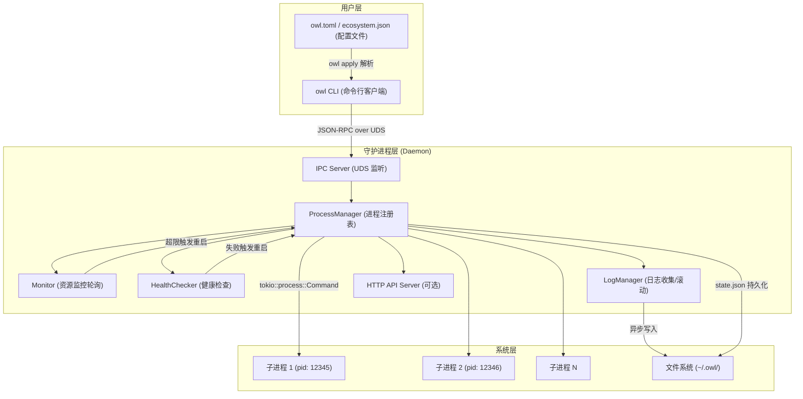
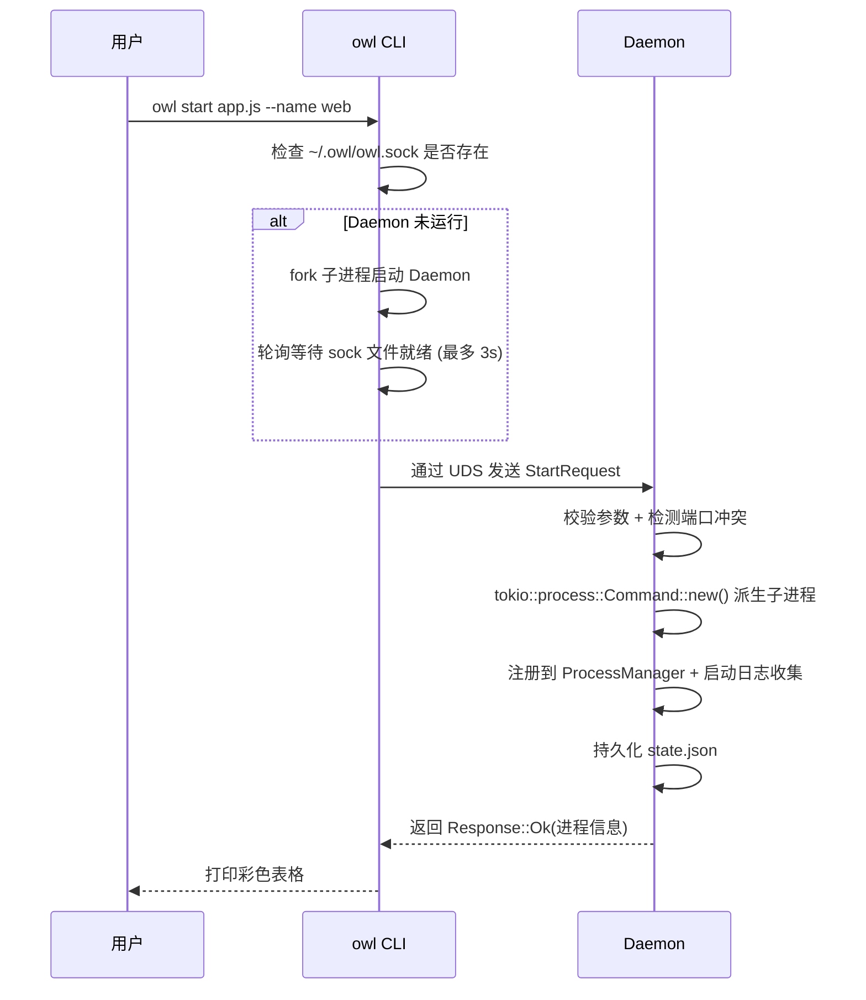

# 实施方案 — Owl 进程管理器 (Rust 版 PM2)

## 项目定位

Owl 是一个使用 **Rust** 编写的高性能、语言无关的进程管理器，定位为 PM2 的生产级替代方案。

> [!TIP]
> 项目名称 **Owl（猫头鹰）** 寓意 "永远醒着、日夜守护你的进程"。

---

## 一、借鉴项目深度分析

### 1.1 PM2 — 经典架构参考

| 特性 | PM2 实现 | Owl 借鉴要点 |
|:---|:---|:---|
| 架构 | Client ↔ Daemon (God.js) 通过 `rpc.sock` 通信 | ✅ 采用相同的 Client-Daemon 分离架构 |
| 进程模型 | `child_process.fork()` + `cluster.fork()` | ✅ 使用 Tokio `Command` 异步派生子进程 |
| 状态持久化 | `dump.pm2` JSON 文件 | ✅ 使用 JSON 持久化到 `~/.owl/state.json` |
| 日志管理 | 重定向 stdout/stderr 到文件 | ✅ 异步管道 + 日志滚动切分 |
| 集群模式 | Node.js `cluster` 模块共享端口 | ⚠️ 不依赖语言特性，改用多实例 + 端口分配 |

### 1.2 OxMgr — 声明式配置思想

| 特性 | OxMgr 实现 | Owl 借鉴要点 |
|:---|:---|:---|
| 配置方式 | `oxfile.toml` 声明式定义 | ✅ 支持 `owl.toml` 声明式批量管理 |
| 幂等操作 | `oxmgr apply` 收敛到期望状态 | ✅ `owl apply` 一键收敛 |
| 重启策略 | `always` / `on-failure` / `never` | ✅ 可配置的重启策略枚举 |
| 系统集成 | 生成 systemd / launchd 配置 | 🔮 Phase 3 考虑 |

### 1.3 PMDaemon — 高级运维特性

| 特性 | PMDaemon 实现 | Owl 借鉴要点 |
|:---|:---|:---|
| 端口管理 | 端口范围分配、冲突检测、运行时覆盖 | ✅ `--port 3000-3003` 或 `auto:5000-5100` |
| 健康检查 | HTTP 探针 + 脚本探针 | ✅ 支持 HTTP/脚本健康检查 |
| 内存限制 | `--max-memory 500M` 超限自动重启 | ✅ 周期性采样 + 阈值触发重启 |
| Web API | Axum REST + WebSocket 实时推送 | ✅ 内置轻量 HTTP API (Phase 2) |
| 阻塞启动 | `--wait-ready` 等健康后才返回 | ✅ CLI 阻塞等待进程就绪 |
| 生态配置 | `ecosystem.json` / YAML / TOML | ✅ 多格式配置文件支持 |

---

## 二、架构设计

### 2.1 三层架构



### 2.2 启动流程



---

## 三、项目源码结构

```
owl/
├── Cargo.toml
├── README.md
├── owl.toml.example          # 声明式配置示例文件
└── src/
    ├── main.rs               # 入口：根据 subcommand 分发到 CLI 或 Daemon
    ├── cli/
    │   ├── mod.rs             # CLI 模块入口
    │   ├── commands.rs        # clap 子命令定义
    │   ├── client.rs          # UDS 客户端：连接 Daemon、发送请求、接收响应
    │   ├── output.rs          # 终端输出格式化（彩色表格、JSON）
    │   └── daemon_launcher.rs # 负责检测并拉起后台 Daemon 进程
    ├── daemon/
    │   ├── mod.rs             # Daemon 模块入口
    │   ├── server.rs          # UDS Server 事件循环（accept + dispatch）
    │   ├── handler.rs         # RPC 请求分发与处理逻辑
    │   └── api.rs             # 可选的 HTTP REST API 服务 (Phase 2)
    ├── process/
    │   ├── mod.rs             # 进程管理模块入口
    │   ├── manager.rs         # ProcessManager：进程注册表、CRUD 操作
    │   ├── entry.rs           # ProcessEntry：单个进程的完整状态与生命周期
    │   ├── monitor.rs         # 资源监控：定期采集 CPU/Memory，触发超限重启
    │   └── health.rs          # 健康检查：HTTP 探针 / 脚本探针
    ├── config/
    │   ├── mod.rs             # 配置解析模块入口
    │   ├── owl_config.rs      # owl.toml 声明式配置解析
    │   └── ecosystem.rs       # PM2 ecosystem.config.json 兼容解析
    ├── log/
    │   ├── mod.rs             # 日志管理模块入口
    │   ├── daemon_log.rs      # Daemon 自身日志 (基于 owl-logger：轮转/压缩/清理)
    │   └── process_log.rs     # 子进程 stdout/stderr 异步管道收集与文件写入
    ├── ipc/
    │   ├── mod.rs             # IPC 协议模块入口
    │   ├── protocol.rs        # 长度前缀帧编解码器 (Length-Delimited Framing)
    │   └── message.rs         # Request / Response 枚举定义
    └── common/
        ├── mod.rs             # 公共模块
        ├── paths.rs           # ~/.owl/ 路径管理
        ├── state.rs           # state.json 持久化读写
        └── errors.rs          # 统一错误类型定义
```

---

## 四、核心数据结构

### 4.1 IPC 消息协议 (`src/ipc/message.rs`)

```rust
use serde::{Deserialize, Serialize};

/// CLI → Daemon 请求
#[derive(Serialize, Deserialize, Debug, Clone)]
pub enum Request {
    Start(StartOptions),
    Stop { id_or_name: String },
    Restart { id_or_name: String },
    Delete { id_or_name: String },
    List,
    Info { id_or_name: String },
    Logs { id_or_name: String, lines: usize, follow: bool },
    Apply { config_path: String },
    Kill, // 终止 Daemon
}

#[derive(Serialize, Deserialize, Debug, Clone)]
pub struct StartOptions {
    pub name: Option<String>,
    pub command: String,
    pub args: Vec<String>,
    pub cwd: Option<String>,
    pub env: HashMap<String, String>,
    pub instances: u32,                       // 默认 1
    pub port: Option<String>,                 // "3000" 或 "3000-3003" 或 "auto:5000-5100"
    pub max_memory: Option<u64>,              // 字节
    pub max_restarts: Option<u32>,            // 最大自动重启次数
    pub restart_delay: Option<u64>,           // 重启间隔 ms
    pub restart_strategy: RestartStrategy,
    pub health_check: Option<HealthCheckConfig>,
    pub wait_ready: bool,
}

#[derive(Serialize, Deserialize, Debug, Clone)]
pub enum RestartStrategy {
    Always,     // 任何退出都重启
    OnFailure,  // 仅非零退出码重启
    Never,      // 不自动重启
}

#[derive(Serialize, Deserialize, Debug, Clone)]
pub struct HealthCheckConfig {
    pub url: Option<String>,          // HTTP 探针 URL
    pub script: Option<String>,       // 脚本路径
    pub interval_secs: u64,           // 检查间隔
    pub timeout_secs: u64,            // 超时时间
    pub max_failures: u32,            // 连续失败次数后标记不健康
}

/// Daemon → CLI 响应
#[derive(Serialize, Deserialize, Debug, Clone)]
pub enum Response {
    Ok(String),
    ProcessList(Vec<ProcessInfo>),
    ProcessDetail(ProcessInfo),
    LogLines(Vec<String>),
    Error(String),
}
```

### 4.2 进程状态 (`src/process/entry.rs`)

```rust
#[derive(Serialize, Deserialize, Debug, Clone)]
pub struct ProcessInfo {
    pub id: u32,
    pub name: String,
    pub command: String,
    pub args: Vec<String>,
    pub pid: Option<u32>,
    pub status: ProcessStatus,
    pub port: Option<u16>,
    pub restarts: u32,
    pub max_restarts: Option<u32>,
    pub uptime_secs: u64,
    pub cpu_percent: f32,
    pub memory_bytes: u64,
    pub max_memory: Option<u64>,
    pub created_at: String,  // ISO 8601
    pub restart_strategy: RestartStrategy,
}

#[derive(Serialize, Deserialize, Debug, Clone, PartialEq)]
pub enum ProcessStatus {
    Online,
    Stopping,
    Stopped,
    Errored,
    Launching,
}
```

### 4.3 声明式配置 (`owl.toml`)

```toml
# owl.toml 示例
[[apps]]
name = "web-api"
command = "node"
args = ["server.js"]
cwd = "/opt/apps/web"
instances = 4
port = "3000-3003"
max_memory = "512M"
restart_strategy = "on-failure"
max_restarts = 10

[apps.env]
NODE_ENV = "production"
LOG_LEVEL = "info"

[apps.health_check]
url = "http://localhost:3000/health"
interval_secs = 30
timeout_secs = 5

[[apps]]
name = "worker"
command = "./target/release/worker"
instances = 2
restart_strategy = "always"
restart_delay = 2000
```

---

## 五、Cargo 依赖选型

| 依赖 | 用途 | 版本说明 |
|:---|:---|:---|
| `tokio` | 异步运行时 + UDS + 子进程管理 | `features = ["full"]` |
| `clap` | CLI 参数解析 | `features = ["derive"]` |
| `serde` + `serde_json` | IPC 消息序列化 / state.json 持久化 | — |
| `toml` | `owl.toml` 配置解析 | — |
| `colored` | 终端彩色输出 | — |
| `tabled` | 终端表格渲染 (`owl list`) | — |
| `chrono` | 时间戳与运行时间计算 | — |
| `dirs` | 跨平台获取 `$HOME` 路径 | — |
| `nix` | Unix 信号发送 (`SIGTERM`, `SIGKILL`) | 仅 Unix |
| `sysinfo` | 跨平台采集进程 CPU / 内存指标 | — |
| **`owl-logger`** | **Daemon 自身日志：彩色输出、文件轮转、gz 压缩、保留期清理、崩溃捕获、结构化 JSON** | **`0.1.4` (自家生态)** |
| `axum` + `tokio-tungstenite` | HTTP API + WebSocket (Phase 2) | 可选 feature |
| `reqwest` | 健康检查 HTTP 探针 (Phase 2) | 可选 |

> [!TIP]
> `owl-logger` 是 Owl 生态的姊妹项目 ([xmi-one/owl-logger](https://github.com/xmi-one/owl-logger))，基于 `tracing` 构建。使用它替代手动配置 `tracing-subscriber`，可获得：一行初始化、按大小自动轮转+gz压缩、保留期自动清理、panic 堆栈捕获、运行时动态调级等生产级能力，且与 Owl 品牌统一。

---

## 六、分阶段实施计划

### Phase 1 — 核心骨架 🏗️ (MVP)

**目标**: 实现最小可用的 Client-Daemon 进程管理器。

| 序号 | 任务 | 涉及模块 |
|:---:|:---|:---|
| 1 | `cargo init` + Cargo.toml 依赖配置 | 根目录 |
| 2 | 实现 `~/.owl/` 目录管理、路径常量 | `common/paths.rs` |
| 3 | 定义 IPC 消息枚举 + 长度前缀编解码器 | `ipc/` |
| 4 | 实现 Daemon UDS Server 事件循环 | `daemon/server.rs` |
| 5 | 实现 CLI 客户端连接 + Daemon 自动拉起 | `cli/client.rs`, `cli/daemon_launcher.rs` |
| 6 | 实现 `ProcessManager`：start/stop/restart/delete/list | `process/manager.rs`, `process/entry.rs` |
| 7 | Daemon 自身日志初始化 (owl-logger) + 子进程 stdout/stderr 管道收集 | `log/daemon_log.rs`, `log/process_log.rs` |
| 8 | 实现 `state.json` 持久化与恢复 | `common/state.rs` |
| 9 | 实现 CLI 彩色表格输出 | `cli/output.rs` |
| 10 | 实现 `owl kill` 终止守护进程 | `daemon/handler.rs` |
| 11 | 自动重启 + 指数退避 + 最大重启次数限制 | `process/entry.rs` |

**Phase 1 交付物**: 可以执行 `owl start`, `owl list`, `owl stop`, `owl restart`, `owl delete`, `owl logs`, `owl kill` 基本命令。

---

### Phase 2 — 高级特性 🔧

**目标**: 补齐生产环境所需的监控、配置、健康检查能力。

| 序号 | 任务 | 涉及模块 |
|:---:|:---|:---|
| 1 | 端口范围分配与冲突检测 | `process/manager.rs` |
| 2 | 资源监控 (CPU/Memory 采集) + 内存超限自动重启 | `process/monitor.rs` |
| 3 | `owl.toml` 声明式配置解析 + `owl apply` 命令 | `config/owl_config.rs` |
| 4 | PM2 `ecosystem.config.json` 兼容解析 | `config/ecosystem.rs` |
| 5 | HTTP 健康检查探针 + 脚本健康检查 | `process/health.rs` |
| 6 | `--wait-ready` 阻塞启动等待就绪 | `cli/commands.rs` |
| 7 | `owl info <name>` 详细信息展示 | `cli/output.rs` |
| 8 | 日志滚动切分（按大小/日期） | `log/manager.rs` |
| 9 | 可配置的重启策略 (`always`/`on-failure`/`never`) | `process/entry.rs` |

---

### Phase 3 — 生态扩展 🌐

**目标**: 面向高级运维场景的扩展特性。

| 序号 | 任务 |
|:---:|:---|
| 1 | 内置 HTTP REST API + WebSocket 实时推送 |
| 2 | 生成 `systemd` / `launchd` 服务单元文件 |
| 3 | `owl save` + `owl resurrect` 开机恢复 |
| 4 | Windows 命名管道支持 |
| 5 | `owl monit` 终端实时监控面板 (TUI) |

---

## 七、关键设计决策

### 7.1 IPC 帧协议

采用 **4 字节大端序长度前缀 + JSON 负载** 的简单可靠方案：

```
┌──────────────┬──────────────────────────┐
│ 4 bytes len  │  JSON payload (UTF-8)    │
│ (big-endian) │  len bytes               │
└──────────────┴──────────────────────────┘
```

### 7.2 Daemon 后台化策略

CLI 通过 `std::process::Command` 启动自身的 `daemon` 子命令：
- Unix: 使用 `setsid()` 创建新会话，重定向 stdin/stdout/stderr 到 `/dev/null`
- 写入 `~/.owl/daemon.pid` 并创建 `~/.owl/owl.sock`
- CLI 以 100ms 间隔轮询 sock 文件出现，最多等待 3 秒

### 7.3 平滑重启 (Graceful Shutdown)

```
1. 发送 SIGTERM → 等待 kill_timeout (默认 5s)
2. 如果超时 → 发送 SIGKILL 强制终止
3. 清理子进程资源 → 根据策略决定是否重启
```

### 7.4 崩溃退避算法

```
restart_delay = min(base_delay * 2^(consecutive_crashes - 1), max_delay)
base_delay  = 1s
max_delay   = 16s

示例: 1s → 2s → 4s → 8s → 16s → 16s → ...
如果进程持续运行超过 30s，则重置 consecutive_crashes = 0
```

---

## 八、验证方案

### 8.1 单元测试

| 模块 | 测试要点 |
|:---|:---|
| `ipc/protocol.rs` | 帧编解码正确性、边界条件（空消息、超大消息） |
| `ipc/message.rs` | 所有 Request/Response 变体的序列化/反序列化 |
| `common/state.rs` | state.json 的写入、读取、损坏恢复 |
| `config/` | TOML/JSON 配置解析、字段缺失默认值 |

### 8.2 集成测试

```bash
# 1. Daemon 自动拉起
owl list
# 验证: daemon.pid 和 owl.sock 已创建

# 2. 基本生命周期
owl start "sleep 100" --name test-app
owl list                    # 状态: Online, PID 有效
owl stop test-app           # 状态: Stopped
owl restart test-app        # 新 PID, 状态: Online
owl delete test-app         # 从列表清除

# 3. 自动重启 + 退避
owl start "sh -c 'exit 1'" --name crasher --restart-strategy on-failure
owl list                    # 多次后观察 restarts 计数递增

# 4. 内存限制 (Phase 2)
owl start "stress --vm 1 --vm-bytes 200M" --name mem-test --max-memory 100M
# 验证: 进程被自动重启

# 5. 声明式配置 (Phase 2)
owl apply owl.toml
owl list                    # 验证所有声明的进程已启动

# 6. 日志
owl start "sh -c 'while true; do echo hello; sleep 1; done'" --name loggy
owl logs loggy --lines 10   # 验证日志输出

# 7. 守护进程终止
owl kill                    # 所有子进程停止, Daemon 退出
```

### 8.3 编译验证

```bash
cargo build --release       # 编译通过，无 warning
cargo test                  # 所有单元测试通过
cargo clippy                # 无 lint 警告
```
